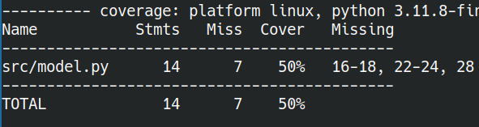

## 

> “Program testing can be a very effective way to show the presence of
> bugs, but it is hopelessly inadequate for showing their absence.”
>
> — <cite>[Edsger W. Dijkstra, “The Humble Programmer”
> (1972)](https://www.cs.utexas.edu/~EWD/transcriptions/EWD03xx/EWD340.html)</cite>

## Imagine You Write a Simple Function

``` python
def add(a, b):
    """Add two values."""
    return a + b
```

How do we know that this is correct?

## Testing our New Function

We can go to the REPL and run the code! For example, we know that
$2 + 2 = 4$:

``` bash
python3
```

and then:

``` python
>>> add(2, 2)
4
```

Seems like our function is doing the right thing!

## Testing a Script

We can test whether a script is running and producing the correct
output:

<div class="columns">

<div class="column" width="45%">

``` python
def add(a, b):
    return a + b

def mul(a, b):
    return a * b

def predict(x):
    intercept = 5
    coef = 0.7
    return add(
        mul(coef, x),
        intercept
    )
```

</div>

<div class="column" width="45%">

``` python
def main():
    for x in range(10):
        y = predict(x)
        print(f"f({x}) = {y}")

if __name__ == "__main__":
    main()
```

</div>

</div>

## Run The Script and Inspect the Output

``` sh
python3 model.py
```

The results will be displayed on the terminal and we can check whether
the results are correct or plausible by hand.

``` txt
f(0) = 5.0
f(1) = 5.7
f(2) = 6.4
f(3) = 7.1
f(4) = 7.8
f(5) = 8.5
f(6) = 9.2
f(7) = 9.899999999999999
f(8) = 10.6
f(9) = 11.3
```

## What is the Problem with this Approach?

## What is the Problem with this Approach

- As projects grow, manually re-testing every script is tedious and
  error prone.
- We forget manual tests that we have done in the past and don’t do it
  again
- We are testing a very limited set of inputs
  - Bugs may only appear for certain edge cases but we are not really
    searching for those

## Instead using REPL or running the Script, we can automate the Testing

We can run these tests all at once using `pytest` which will tell us if
they pass or fail.

``` sh
pip install pytest
pytest src/tests/
```

<div class="columns">

<div class="column">

``` python
def add(a, b):
    return a + b

def mul(a, b):
    return a * b
```

</div>

<div class="column">

``` python
def test_add():
    result = add(2, 2)
    assert result == 4

def test_mul():
    result = mul(2, 2)
    assert result == 4
```

</div>

</div>

## Pass

<figure>

<figcaption aria-hidden="true">PASSED</figcaption>
</figure>

## Introduce a bug:

<div class="columns">

<div class="column">

``` python
def add(a, b):
    return a - b
```

``` sh
pytest src/tests/
```

</div>

<div class="column">

<figure>

<figcaption aria-hidden="true">FAIL</figcaption>
</figure>

</div>

</div>

## We can get a Report on line coverage using the `pytest-cov` plugin

``` sh
pip install pytest-cov
```

From the repository root run:

``` sh
pytest src/tests/ --cov=src
```

<figure>

<figcaption aria-hidden="true">coverage</figcaption>
</figure>

## We can also see which lines in our code are not executed in tests:

From the repository root run:

``` sh
pytest src/tests/ --cov=src --cov-report term-missing
```

<figure>

<figcaption aria-hidden="true">coverage term missing</figcaption>
</figure>

## Lastly, for long test suites: Use ALL the cores!

If you have lots of tests and they take some time you can use
`pytest-xdist` which will run tests in parallel when you use the `-n`
flag:

``` sh
pip install pytest-xdist
pytest src/tests/ --cov=src --cov-report term-missing -n 16
```

Note, that in our example this will run slower since we only have two
functions and the parallelising overhead is not really worth it. But if
your tests are running longer than a few seconds, this will likely
already be worth it.

## A Note On Importing Your Functions to a Test Module

Importing python modules can be tricky. Pytest uses the `__init__.py` to
realise that the test module is part of a python package and can use
init files to find the necessary imports, so make sure not to forget
them if you are using relative imports in your test files. The `tree`
for our example repo looks like that:

<figure>

<figcaption aria-hidden="true">innit</figcaption>
</figure>

## Importing your Modules to Test Files

``` python
import sys
from pathlib import Path

# The import is a bit messier and could simply
# be:
# from ..model import add, mul, predict
# if we only wanted to use pytest.
# The below import also enables us to directly
# run tests without packaging and installing our
# project if we ever want to do that.
src = Path(__file__).parents[0] / ".." / "."
print(src)
sys.path.append(str(src))
```

## Packaging your Project

- if you have a medium/large sized folder of files with code that is
  shared by different executables, you probably want to properly package
  it (by that I only mean making the local project installable via pip,
  NOT necessarily publishing on [PyPI](https://pypi.org/))
  - see [Publishing a Python
    Package](https://realpython.com/pypi-publish-python-package/)
  - see [Video on packaging with historical
    context](https://pyvideo.org/pycon-uk-2019/what-does-pep-517-mean-for-packaging.html)
- python/pytest `import` f\*\*\*ery can be quite confusing
  - see [Pytest: Good Integration
    Practices](https://docs.pytest.org/en/7.1.x/explanation/goodpractices.html)
  - see [Blog post on package layout and problems it can induce to
    python/pytest import
    f\*\*\*ery](https://blog.ionelmc.ro/2014/05/25/python-packaging/#the-structure%3E)
- if your project is packaged and you want to specifically test the
  installed version rather than local modules available in your
  `$PYTHONPATH`, you may want to look into using
  [tox](https://tox.wiki/en/stable/index.html)
- **The main point here is that you do NOT need to properly package your
  project in order to write and run tests with pytest. You can do this
  easily with any project you already have that defines any functions or
  classes you can import elsewhere.**

## What do you think about these tests?

<div class="columns">

<div class="column">

``` python
def add(a, b):
    return a + b

def mul(a, b):
    return a * b
```

</div>

<div class="column">

``` python
def test_add():
    result = add(2, 2)
    assert result == 4

def test_mul():
    result = mul(2, 2)
    assert result == 4
```

</div>

</div>

## Consider this Bug:

<div class="columns">

<div class="column">

``` python
def add(a, b):
    return a * b

def mul(a, b):
    return a + b
```

</div>

<div class="column">

``` python
def test_add():
    result = add(2, 2)
    assert result == 4

def test_mul():
    result = mul(2, 2)
    assert result == 4
```

</div>

</div>

The behaviour of the functions has completely changed, but the tests
will pass, so we might think all is well!

## Mutation Testing

This is precisely what mutation testing does: It takes your code and
creates mutated variants of your code. It will then run your tests to
see if your tests are good enough to catch the mutation. If your tests
still pass, you might have to improve your testing! In this example it
may be enough to simply add a few more test cases:

<div class="columns">

<div class="column">

``` python
def add(a, b):
    return a * b
```

</div>

<div class="column">

``` python
def test_add():
    result = add(2, 2)
    assert result == 4
    
    result = add(7, 2)
    assert result == 9

    result = add(1, 2)
    assert result == 3
```

</div>

</div>

## Mutation Testing in Python

| Name/Link                                            | Pros                                                  | Cons                                                                      |
|------------------------------------------------------|-------------------------------------------------------|---------------------------------------------------------------------------|
| [mutmut](https://mutmut.readthedocs.io/en/latest/)   | Actively maintained, can cache previous progress      | Not written by me                                                         |
| [pymute](https://github.com/LeSasse/pymute)          | Written by me                                         | Can’t cache previous progress (yet)                                       |
| [mut.py](https://github.com/mutpy/mutpy)             | Couldn’t find any                                     | Not actively maintained, not compatible with current versions, do not use |
| [mut.py fork](https://github.com/se2p/mutpy-pynguin) | Was forked because mut.py was not actively maintained | Also not actively maintained                                              |
|                                                      |                                                       |                                                                           |

## A bunch of other potentially useful links and ressources:

[Use Pytest Approx to for Numerical Accuracy a.k.a don’t simply test
equality of
floats](https://pytest-with-eric.com/pytest-advanced/pytest-approx/)
