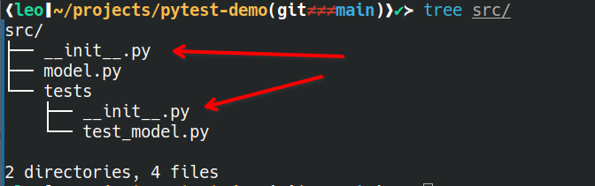

## Imagine You Write a Simple Function


```python
def add(a, b):
    """Add two values."""
    return a + b

```


How do we know that this is correct?


## Testing our New Function

We can go to the REPL and run the code!
For example, we know that $2 + 2 = 4$:

```bash
python3
```
and then:
```python
add(2, 2)
>>> 4
```
Seems like our function is doing the right thing!

## Testing a Script

We can test whether a script is running and producing the correct output:

:::::: {.columns}
:::: {.column width="45%"}

```python
def add(a, b):
    return a + b

def mul(a, b):
    return a * b

def predict(x):
    intercept = 5
    coef = 0.7
    return add(
        mul(coef, x),
        intercept
    )

```

::::
:::: {.column width="45%"}

```python
def main():
    for x in range(10):
        y = predict(x)
        print(f"f({x}) = {y}")

if __name__ == "__main__":
    main()
```

::::
:::::::

## Run The Script and Inspect the Output

```sh
python3 model.py
```
The results will be displayed on the terminal and we can check whether the results
are correct or plausibel by hand.

```txt
f(0) = 5.0
f(1) = 5.7
f(2) = 6.4
f(3) = 7.1
f(4) = 7.8
f(5) = 8.5
f(6) = 9.2
f(7) = 9.899999999999999
f(8) = 10.6
f(9) = 11.3
```

## What is the Problem with this Approach?

## What is the Problem with this Approach

* As projects grow, manually re-testing every script is tedious and error prone.
* We forget manual tests that we have done in the past and don't do it again
* We are testing a very limited set of inputs
  * Bugs may only appear for certain edge cases but we are not really searching for those

## Instead using REPL or running the Script, we can automate the Testing


We can run these tests all at once using `pytest` which will
tell us if they pass or fail.

```sh
pytest src/tests/
```

::: {.columns}
:::: {.column}
```python
def add(a, b):
    return a + b

def mul(a, b):
    return a * b
```
::::
:::: {.column}

```python
def test_add():
    result = add(2, 2)
    assert result == 4

def test_mul():
    result = mul(2, 2)
    assert result == 4

```

::::
:::

What do you think about these tests?

## Consider this Bug:


::: {.columns}
:::: {.column}
```python
def add(a, b):
    return a * b

def mul(a, b):
    return a + b
```
::::
:::: {.column}

```python
def test_add():
    result = add(2, 2)
    assert result == 4

def test_mul():
    result = mul(2, 2)
    assert result == 4

```

::::
:::

The behaviour of the functions has completely changed,
but the tests will pass, so we might think all is well! 

## Mutation Testing

This is precisely what mutation testing does: It takes your code and creates
mutated variants of your code. It will then run your tests
to see if your tests are good enough to catch the mutation. If your tests
still pass, you might have to improve your testing! In this example
it may be enough to simply add a few more test cases:


::: {.columns}
:::: {.column}
```python
def add(a, b):
    return a * b
```
::::
:::: {.column}

```python
def test_add():
    result = add(2, 2)
    assert result == 4
    
    result = add(7, 2)
    assert result == 9

    result = add(1, 2)
    assert result == 3
```
::::
:::

## A Note On Importing Your Functions to a Test Module

Importing python modules can be tricky. Pytest
uses the `__init__.py` to realise that
the test module is part of a python
package and can use init files to find the 
necessary imports, so make sure not to forget them. The `tree`
for our example repo looks like that:



## We can get a Report on line coverage using the `pytest-cov` plugin

```sh
pip install pytest pytest-cov
```
From the repository root run:
```sh
pytest src/tests/ --cov=src
```


